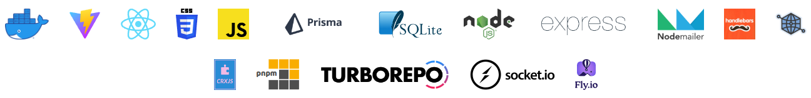

# JobAppTrack.com

**RECENT UPDATES**
\
**May 23, 2023: ADD FILTER FUNCTIONALITY AND COMPONENT. STILL NEED TO SEPARATE JOBAPP COMPONENT INTO CREATE/EDIT COMPONENTS.**

[JobAppTrack.com](https://jobapptrack.com) is a tool that allows users to track job applications.

As a coding bootcamp instructor, I saw my students struggle to apply for jobs and track their stages in the interview process. I built this job application tracker web app and chrome extension for them using modern web technologies.

Users can create account an account, create and track individual job applications, add notes to job applications, update the statuses of their applications,
reset their password with email and a secure token, and use a chrome extension to add new job applications from different tabs so that they aren't required
to always have the web application open in a different window.

The code itself is organized as a monorepo using pnpm workspaces with three different apps and various reusable packages.

The three apps are the API, the web app, and the chrome extension.

Within the packages, I won't go into detail besides mentioning one of them: the react-auth package. It was arguably the most useful of the packages, because it allowed the authentication code to be written once and then shared between both the chrome extension and the web application, saving me from having to duplicate the logic.

For deployment, I use a Dockerfile and Fly.io. Funny enough, Fly.io doesn't actually deploy Docker containers. They use my Dockerfile to construct a Firecracker "microvm", which sounds cool and seems to be effective, but I haven't spent enough time studying them yet. The only trick to deploying on Fly.io was that I needed a very short custom bash script to run the Prisma migrations before starting the server because I didn't have access to the volume containing my SQLite database during the build process.

Technologies used for this project include the following:

